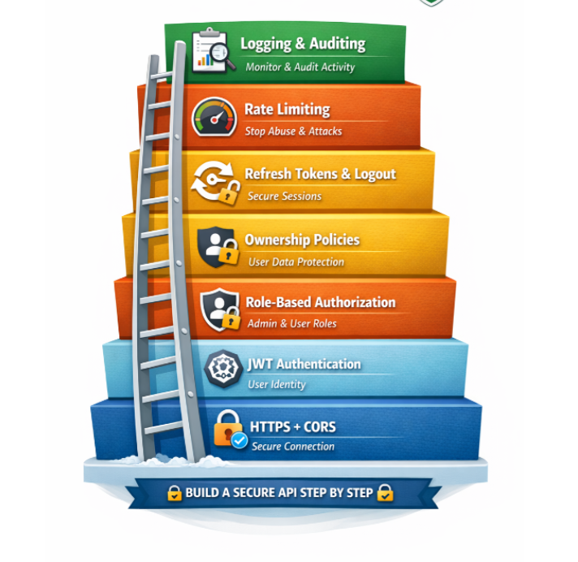

# SecurityLayers

A step-by-step reference project for building a secure API — one layer at a time. Each layer builds on the last, going from a bare HTTPS connection up to full logging and auditing.

  

## The 7 Layers

| # | Layer | Purpose |
|---|-------|---------|
| 1 | 🔒 **HTTPS + CORS** | Secure Connection — encrypt traffic and restrict which origins can call the API |
| 2 | ⚙️ **JWT Authentication** | User Identity — verify who is making the request |
| 3 | 🛡️ **Role-Based Authorization** | Admin & User Roles — control what authenticated users are allowed to do |
| 4 | 🔐 **Ownership Policies** | User Data Protection — ensure users can only access/modify their own data |
| 5 | 🔄 **Refresh Tokens & Logout** | Secure Sessions — handle token renewal and proper session termination |
| 6 | 🚦 **Rate Limiting** | Stop Abuse & Attacks — throttle requests to prevent brute force and DoS |
| 7 | 📋 **Logging & Auditing** | Monitor & Audit Activity — track what happened, when, and by whom |

## Goal

Implement each layer incrementally so the API is secure by design rather than bolted on after the fact. Each layer should be functional and tested before moving to the next.

## Status

🚧 Work in progress — layers are being built and documented one at a time.

## Getting Started

_Setup instructions will be added as the project takes shape (stack, install steps, environment variables, etc.)._

## License

TBD
